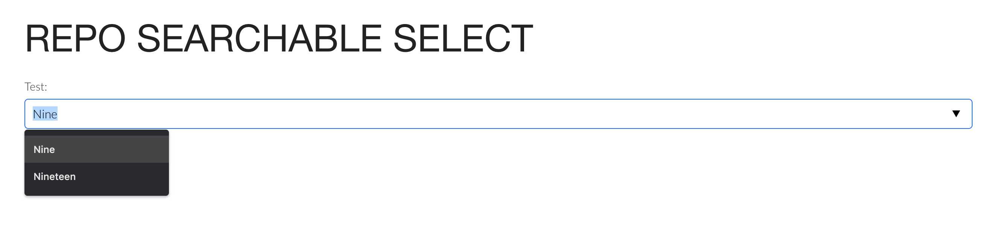

<div style="text-align: center; margin-top: 50px;" >


# Repo Searchable Select
###### by Repo Tech Team

</div>

## What is it?

_Repo Searchable Select_ is basically a searchable `HTMLSelectElement` written in [VueJS](http://vuejs.org) which can be used in any web page or web application that needs a powerfull yet simple and intuitive way to provide searchable lists.

It was build to be used on [RepoTenshoku](https://repotenshoku.com/en) App, aiming to replace native HTMLSelectElements empowered by javascript plugins in order to create a searchable experience to the end users.

#### The problem

We've noticed the approach used by these javascript plugins (e.g: [Selectize.js](https://selectize.github.io/selectize.js)) works very well on desktop browsers, because they solve the problem by replacing the native `HTMLSelectElement` by a `HTMLInputElement` which feels the first, and when on focus, creates a composition of attached `HTMLDivElement` to reproduce the `HTMLOptionElement`.

However, when it comes to the mobile browsers, the user experience is actually really bad, because the people using your web application over a mobile device won't be able to take advantage of the native HTMLSelectElement options list.

#### The solution



_Repo Searchable Select_ mixes 2 `HTML5` elements (`HTMLInputElement` and `HTMLDatalistElement`) to create a smooth, highly customizable and transparent solution that work very well for both desktop and mobile devices, yet providing the needed searchable capability to (what looks like) a `HTMLSelectElement`.

## Get started

We're assuming you're going to use _Repo Searchable Select_ on your `Javascript` project, using `Node.js`. That said, install it as a dependency to your project.

E.g:
```sh
$ npm install -S https://github.com/repotenshoku/repo-searchable-select-vue
```

Import it to your project, e.g:

```js
import RepoSearchableSelect from 'repo-searchable-select-vue';

// ...

Vue.component(RepoSearchableSelect);


var app = new Vue({
    el: '#app',

    data() {
        return {
            // The options that are gonna to be seen in RepoSearchableSelect
            options: [
                { id: '', value: '' },
                { id: '0', value: 'Zero' },
                { id: '1', value: 'One' },
                { id: '2', value: 'Two' }
            ]
        };
    },

    methods: {
        // When something changes a "change" event is fired.
        onChange(data) {
            console.log('CHANGED', data);
        }
    }
});

// ...
```

Then, add it to your templates, e.g:

```html
<html >

    <!-- ... -->

    <div id="app" >
        <repo-searchable-select
            name="my-select"
            value=""
            v-on:change="onChange"
            v-bind:options="options"
        ></repo-searchable-select>
    </div>

    <!-- ... -->

</html>
```

## Options

The following attributes are supported:

Attribute | Required | Type | Remark
--------- | -------- | ---- | ------
options | Required | `Array< Object<id, value> >` |  
name | Required | `String` | | 
id | Optional | `String` | When not given `name` is used.  
value | Optional | `String` | 
required | Optional | `void|string` | 
placeholder | Optional | `String` |
... | Optional | |  Even though not directly supported, any other HTML element attribute will be placed in the component which can be used for customizations.

## Events

The following events are triggered:


Event | When | Return
----- | ---- | ------
change | Always an option is selected | `{id: 'selected-id', value: 'selected-value'}` or `null` when the option is not found.

## Get support

Found a bug? Don't worry, we're keen to see it fixed, after all, we also use this in production 😉! Please open an [Issue](https://github.com/RepoTenshoku/repo-searchable-select-vue/issues) and tell us what is going on. Contributions are also very welcome and can be done via [Pull Requests](https://github.com/RepoTenshoku/repo-searchable-select-vue/pulls). 

Just wanna say hi? Drop a line to [@repotenshoku](https://twitter.com/repotenshoku) on Twitter and show your support 🤘.

## Backlog

Here's a list of features we still want to implement:

- Load options from API while searching
- Create options when they do not exist
- Support multiple selection
- Filter in the options
